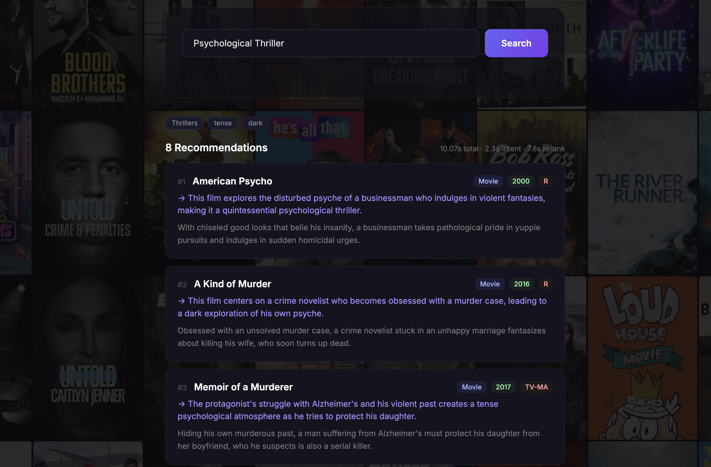
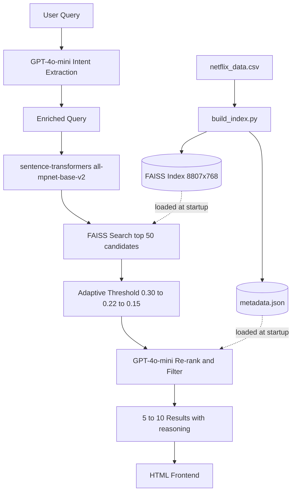

# CineMatch -  Movie Recommendation Engine

A content-based movie recommendation system that uses **two-stage retrieval** (FAISS dense retrieval + GPT-4o-mini re-ranking) to answer natural language queries like *"something dark and psychological like Inception"* against 8,807 Netflix titles.

### Homepage


### Search Results: "Psychological Thrillers"



*The system successfully retrieved and ranked 5 top-tier results for the query, complete with per-item reasoning.*


## Architecture



## AI Setup

| Component | Provider | Model | Runs |
|-----------|----------|-------|------|
| Intent extraction | OpenAI | `gpt-4o-mini` | Per request (~2s) |
| Re-ranking | OpenAI | `gpt-4o-mini` | Per request (~5s) |
| Embeddings | Local | `all-mpnet-base-v2` (768d) | Build time + per request |
| Vector search | Local | FAISS `IndexFlatIP` | Per request (<1ms) |

**Reviewer requirement:** Set `OPENAI_API_KEY` at runtime. The system degrades gracefully without it (FAISS-only results + info banner), but recommendation quality depends on the LLM re-ranking stage.

## Approach

## Approach

CineMatch uses a two-stage content-based retrieval pipeline that separates retrieval (high recall) from re-ranking (high precision), allowing each stage to optimize for what it does best.

### Query Understanding

Raw natural language queries are first processed by GPT-4o-mini to extract structured intent - genres, mood, themes, content type, and era. A vague query like *"something cozy for a rainy Sunday"* is expanded into a dense paragraph of semantic anchors (*"warm, comforting films with gentle storytelling, themes of home and friendship..."*), giving the embedding model 20+ meaningful terms instead of 5 vague words. This enriched query is what gets embedded - not the raw input.

### Movie Representation

Each of the 8,807 Netflix titles is converted into a rich text representation combining type, genre, rating, country, cast, director, and description into a single string. The description is placed last to give it the most weight in the embedding model's attention. Duration is deliberately excluded - it is a filter, not a semantic signal. A 90-minute thriller and a 180-minute thriller can be equally relevant; embedding duration would pull vectors toward films of similar length regardless of content.

### Retrieval

The enriched query is embedded using `all-mpnet-base-v2` (768-dimensional, cosine-trained) and searched against a FAISS `IndexFlatIP` index of pre-computed title vectors. IndexFlatIP on L2-normalized vectors is mathematically equivalent to cosine similarity - the correct metric for sentence-transformers. FAISS returns the top 50 candidates in under 1ms.

### Adaptive Threshold

Rather than a fixed similarity cutoff, CineMatch uses a cascade: strict (0.30) for specific queries that produce high FAISS scores, relaxing to 0.22 then 0.15 for abstract mood queries where no single title is a near-exact match. Query complexity (word count) also influences the starting threshold - a two-word query like *"funny movie"* starts at 0.15 directly, while a detailed query like *"psychological thriller with an unreliable narrator"* starts at 0.30. This prevents both over-filtering vague queries and under-filtering precise ones.

### Re-ranking

The surviving FAISS candidates - along with their cosine similarity scores - are passed to GPT-4o-mini for re-ranking against the full query intent. Passing similarity scores gives the re-ranker quantitative context alongside its qualitative reasoning. The re-ranker applies constraints embedding similarity alone cannot capture: rating filters for family queries, content-type exclusions (no stand-up specials for *"comedy movie"*), director accuracy checks, and thematic relevance scoring. It returns 5-10 results with per-item reasoning, dropping weak matches rather than padding to a fixed count.

### Index at Build Time

Embedding 8,807 titles takes approximately 3 minutes on CPU. Running this at container startup would add a 3-minute delay before the server accepts requests. Building the FAISS index at Docker build time bakes it into the image - container startup takes under 5 seconds by loading the pre-built index directly into memory.
## Setup

### Prerequisites

- Docker
- OpenAI API key ([platform.openai.com](https://platform.openai.com))

### Build & Run

```bash
# Build the image (~5 min: downloads model + generates FAISS index)
docker build -t cinematch .

# Run the container
docker run -p 8080:80 -e OPENAI_API_KEY=your-openai-key cinematch
```

Open [http://localhost:8080](http://localhost:8080)

### Without Docker (local development)

```bash
pip install -r requirements.txt
python scripts/build_index.py      # One-time: generates FAISS index
uvicorn src.main:app --host 0.0.0.0 --port 8080
```

> Note: `posters.json` is pre-committed to the repo. Running `scripts/fetch_posters.py` is only needed if you want to refresh poster images (requires `TMDB_API_KEY`).

## Demo

### Sample Queries

| Query | What it tests |
|-------|---------------|
| *"something dark and psychological like Inception"* | Semantic similarity + comparison |
| *"feel-good comedy for family night"* | Mood extraction + rating filtering |
| *"Korean drama with romance"* | Genre + region constraint |
| *"if I liked Parasite what should I watch next"* | Reference-based recommendation |
| *"movies directed by Christopher Nolan"* | Director lookup + honesty (limited data) |
| *"documentary about nature"* | Content-type filtering |

### Features


- **Transparency notes:** Info banner when few direct matches exist (e.g., director queries)
- **Graceful degradation:** Without API key, shows FAISS results with explanation banner


## Project Structure

```
├── src/
│   ├── main.py              # FastAPI server, lifespan resource loading
│   └── query_pipeline.py    # Two-stage pipeline: intent > embed > FAISS > rerank
├── scripts/
│   ├── build_index.py       # Offline: CSV > embeddings > FAISS index
│   └── fetch_posters.py     # Offline: TMDB API > poster URLs (optional, pre-committed)
├── frontend/
│   └── index.html           # Single-page UI with poster collage
├── data/
│   ├── netflix_data.csv     # Source dataset (8,807 titles)
│   ├── posters.json         # Pre-fetched TMDB poster URLs
│   ├── faiss.index          # Generated at build time
│   ├── metadata.json        # Generated at build time
│   └── embeddings.npy       # Generated at build time
├── test/
│   └── qa_test.py           # QA test suite (25 queries)
├── Dockerfile
├── requirements.txt
└── README.md
```